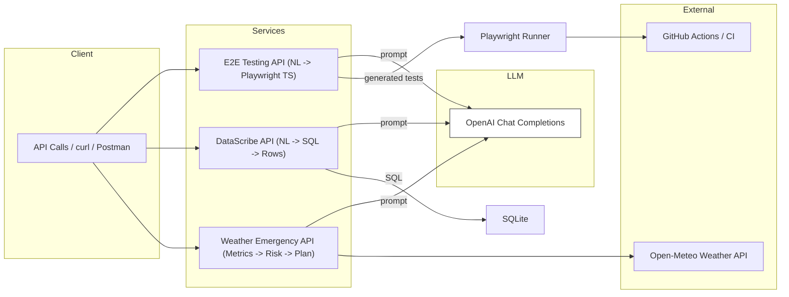

# 🔧 ai-agents-portfolio

> **Agentic AI, packaged like production.**  
> Three tiny FastAPI services that showcase practical agent patterns—tool use, data access, testing, and real-time decision support—designed to be easy to run, demo, and extend.

[](https://www.python.org/)
[](https://fastapi.tiangolo.com/)
[](https://playwright.dev/)
[](#credits--license)

---

## 📦 What’s inside

1) **Weather Emergency Agent** – calls a public weather API and generates an **ops-ready** risk/response plan.  
2) **DataScribe** – converts **natural language → SQL** (SQLite demo) and returns result rows.  
3) **E2E Testing Agent** – turns **natural language → Playwright** tests and can run them (great for CI/CD “quality gates”).

---

## 🗺️ Architecture (high level)



---

## 📚 Table of contents

- [Quickstart](#quickstart)
- [Environment](#environment)
- [Install & Seed Demo Data](#install--seed-demo-data)
- [Run the agents](#run-the-agents)
- [Call the endpoints (PowerShell & curl)](#call-the-endpoints-powershell--curl)
  - [Weather Emergency Agent (8002)](#weather-emergency-agent-port-8002)
  - [DataScribe Agent (8001)](#datascribe-nlsql-agent-port-8001)
  - [E2E Testing Agent (8000)](#e2e-testing-agent-port-8000)
- [Tests](#tests)
- [Troubleshooting](#troubleshooting)
- [Credits & License](#credits--license)

---

## ⚡ Quickstart

```bash
python -m venv .venv && . .venv/Scripts/activate
pip install -r requirements.txt
```

> **Models:** set `OPENAI_API_KEY` in a `.env` (see below). Default model is `gpt-4o-mini`.  
> Swap via `OPENAI_MODEL=...` if your account offers a different model.

---

## 🔐 Environment

Create **.env** in the repo root:

```
OPENAI_API_KEY=sk-********************************
# optional
OPENAI_MODEL=gpt-4o-mini
```

> The services read this automatically via `dotenv`.

---

## 🧰 Install & Seed Demo Data

Some agents use extra tooling once:

```bash
# Install Playwright browsers (for the E2E agent)
python -m playwright install
```

Seed the SQLite demo DB for **DataScribe**:

```bash
python ./services/datascribe/seed_test_data.py
```

Initialize Node deps (for Playwright runner):

```bash
cd services/e2e-testing
npm init -y
npm i -D @playwright/test
npx playwright install
cd ../..
```

---

## ▶️ Run the agents

Open 3 terminals (or use PowerShell tabs):

```bash
# Terminal 1
uvicorn services.weather_emergency.app:app --port 8002

# Terminal 2
uvicorn services.datascribe.app:app --port 8001

# Terminal 3
uvicorn services.e2e_testing.app:app --port 8000
```

> Tip: add a local `run_all.ps1` that launches all three if you prefer.

---

## 📡 Call the endpoints (PowerShell & curl)

Below are **PowerShell** and **curl** examples you can paste into your terminal to exercise each agent.

### 🌩️ Weather Emergency Agent (port `8002`)

**PowerShell**
```powershell
$body = @{ lat = "17.3850"; lon = "78.4867" } | ConvertTo-Json
Invoke-RestMethod `
  -Uri "http://127.0.0.1:8002/assess" `
  -Method POST `
  -ContentType "application/json" `
  -Body $body | ConvertTo-Json -Depth 20
```

**curl**
```bash
curl -s -X POST "http://127.0.0.1:8002/assess"   -H "Content-Type: application/json"   -d '{"lat":"17.3850","lon":"78.4867"}'
```

---

### 🧠 DataScribe (NL→SQL) Agent (port `8001`)

**PowerShell**
```powershell
$body = @{ question = "Total revenue by SKU for February 2025, highest first" } | ConvertTo-Json
Invoke-RestMethod `
  -Uri "http://127.0.0.1:8001/query" `
  -Method POST `
  -ContentType "application/json" `
  -Body $body | ConvertTo-Json -Depth 20
```

**curl**
```bash
curl -s -X POST "http://127.0.0.1:8001/query"   -H "Content-Type: application/json"   -d '{"question":"Total revenue by SKU for February 2025, highest first"}'
```

---

### ✅ E2E Testing Agent (port `8000`)

**PowerShell**
```powershell
# Generate a test from a natural-language spec
$genBody = @{ spec = "Open https://www.cvinayreddy.com and assert title contains 'portfolio'" } | ConvertTo-Json
Invoke-RestMethod `
  -Uri "http://127.0.0.1:8000/generate" `
  -Method POST `
  -ContentType "application/json" `
  -Body $genBody | ConvertTo-Json -Depth 20

# Run the generated test
Invoke-RestMethod -Uri "http://127.0.0.1:8000/run" -Method POST | ConvertTo-Json -Depth 20
```

**curl**
```bash
# Generate a test from a natural-language spec
curl -s -X POST "http://127.0.0.1:8000/generate"   -H "Content-Type: application/json"   -d '{"spec":"Open https://www.cvinayreddy.com and assert title contains '''portfolio'''"}'

# Run the generated test
curl -s -X POST "http://127.0.0.1:8000/run"
```

---

## 🧪 Tests

Run all tests (uses FastAPI’s TestClient, so you don’t need to start servers first):

```bash
pytest -q
```

- **E2E agent**: verifies generated TS file structure; optionally runs Playwright if present.  
- **DataScribe**: checks NL→SQL returns `{sql, rows}` and includes a basic guardrail against non-SELECT SQL.  
- **Weather**: checks response shape `{metrics, plan}` and the presence of a `Risk:` line.

---

## 🛠️ Troubleshooting

- **`401/403` from LLM** → Confirm `OPENAI_API_KEY` is set in `.env`, and your model name is available to your account.  
- **Playwright “browser not found”** → Re-run `python -m playwright install` and `npx playwright install`.  
- **DataScribe empty results** → Ensure you ran the **seed script** to create `datascribe_demo.db`.  
- **Windows quoting in curl** → Use the PowerShell blocks above or escape quotes carefully as shown.


---

## 🙌 Shout-out

This portfolio **borrows ideas and task formulations** from **Nir Diamant’s excellent reference repo**:  
**NirDiamant / GenAI_Agents** → https://github.com/NirDiamant/GenAI_Agents

- Nir’s repo focuses on **educational, notebook-based** demos across many agent use cases.  
- This portfolio re-imagines them as **small, testable FastAPI microservices** that are more production ready

> Please read Nir’s repo and **license terms**. This portfolio is for **learning and non-commercial** demonstration only.

---

## 🧾 Credits & License

- Demos inspired by **Nir Diamant’s** outstanding work:  
  **NirDiamant / GenAI_Agents** – https://github.com/NirDiamant/GenAI_Agents  
- This repository is a **learning/portfolio** wrapper. Please respect the **non-commercial** spirit.  
- Copyright © 2025. All trademarks and product names are the property of their respective owners.
